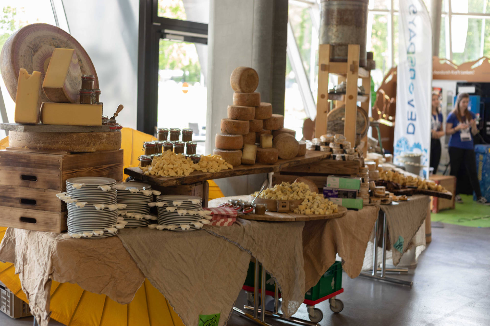
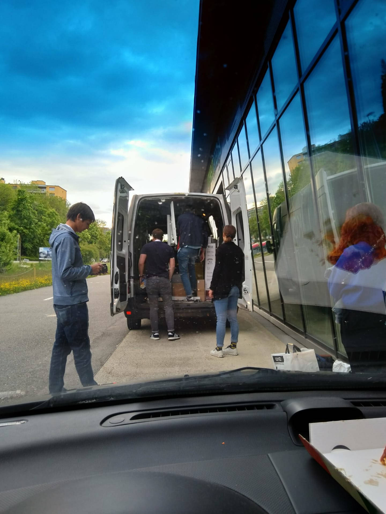

_Montag, 13. Mai, mittags_

Der Bus («Danke YOKKO») ist bereit, die Reise nach Spreitenbach in die Umweltarena anzutreten. Das Ziel: Die DevOpsDays 2019. Bepackt mit lauter gelben Sachen trifft sich das APPUiO-Team in Zürich. Nun heisst es: anpacken, aufbauen und schlussendlich...sich freuen.

_Montag, 13. Mai, abends_

«Yes it's done» - Unser APPUiO-Stand steht bereit für die nächsten zwei Tage. Alle halfen mit viel Fleiss und Liebe zum Detail den Stand zu schmücken und für die Teilnehmenden interessant zu gestalten. Das buntgemischte APPUiO-Team aus [VSHNers](https://vshn.ch/) und [Puzzlers](https://www.puzzle.ch/de/) gibt dem Stand wahrscheinlich das gewisse Etwas. Das Ergebnis lässt sich jedenfalls zeigen.

_Dienstag, 14. Mai, morgens_

Das Team wartet gespannt auf die Gäste und verleiht dem Stand den letzten Schliff, damit die Teilnehmenden ein optimales APPUiO-Erlebnis geniessen können. Zwei Arcades stehen für die anstehenden Battles bereit. Im Gewinner-Pot liegen Vouchers von APPUiO und [cloudscale.ch](https://www.cloudscale.ch/de/) und eine Lego Saturn V Rakete. Weiteres Spielvergnügen bietet der Retro-Rohrfernseher mit der angeschlossenen Nintendo 64. Auf der gemütlichen Sofaecke lässt es sich verweilen, sich austauschen oder die Präsentationen verfolgen.

Bereits vor den ersten Präsentationen wagen sich einige Teilnehmenden in die Höhle der Arcade-Löwen und wollen den Highscore erreichen. Begeisterung zeigen die Besucher auch für unser [APPUiOli](https://appuio.ch/blog.html#APPUiO%20an%20den%20DevOpsDays%202018). In Gesprächen erfahren sie zudem mehr über APPUiO, die nächsten Etappen und Ziele.

_Dienstag, 14. Mai, abends_

Der erste Tag ist geschafft! Bei einem Bier, einem super Apéro und tollen Gesprächen lässt sich der Tag wunderbar ausklingen. Das Team durfte viele neue Kontakte knüpfen und freut sich über das grosse Interesse an APPUiO. Auch unsere Community war stolz vertreten, viele der Community-Mitglieder besuchte APPUiO am Stand. Dabei merken wir, wie gross die Community von APPUiO bereits geworden ist. Dies lässt auf weitere gemeinsame Innovationen und coole Events hoffen. Wir freuen uns, auf das, was kommt!

_Mittwoch, 15. Mai, mittags_

Neuer Tag, neues Glück? Das denken sich wahrscheinlich auch einige der Besucher und wagen erneut ein Arcade-Battle. Für die APPUiO-Sockenträger unter den Besuchern gibt es eine kleine Überraschung: Als Merci für ihre Treue erhalten sie ein Mandelbärchen. ...und wer nicht Süsses mag, kann auch Saures haben… Die Gummibärchen im APPUiO-Style helfen nicht nur bei den Spielbattles als Nervennahrung, sondern auch unserem [Markus Speth](https://vshn.ch/vshn/). Der APPUiO-Marketingexperte darf am Nachmittag in einem Pitch APPUiO vorstellen.

_Mittwoch, 15. Mai, abends_

Auch dieser Tag geht langsam zu Ende. Als Krönung werden die drei Gewinner des Arcade-Wettbewerbs - Alvise Dorigo, Michael Gerber und Carlo Speranza - geehrt. Müde aber zufrieden verabschiedet das APPUiO-Team die letzten Besucher. Nach der kurzen aber intensiven Aufräumaktion finden dann auch die «APPUiOler» den Weg nach Hause. Wir bedanken uns ganz herzlich für die tollen Bekanntschaften, spannenden Gesprächen und für euren Besuch an unserem Stand. Es hat uns einen Riesenspass gemacht! Und wir freuen uns, wenn es wieder heisst: DevOpsDays 2020!

Und falls du Nervennahrung brauchst, kalte Füsse hast oder deinen Laptop in APPUiO-Style aufpimpen willst, dann meld dich bei uns. #APPUiOGummibärchen #APPUiOSocken #Stickers ;-)

Bis dann!

