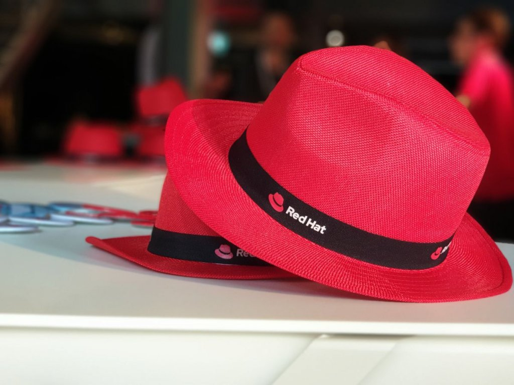
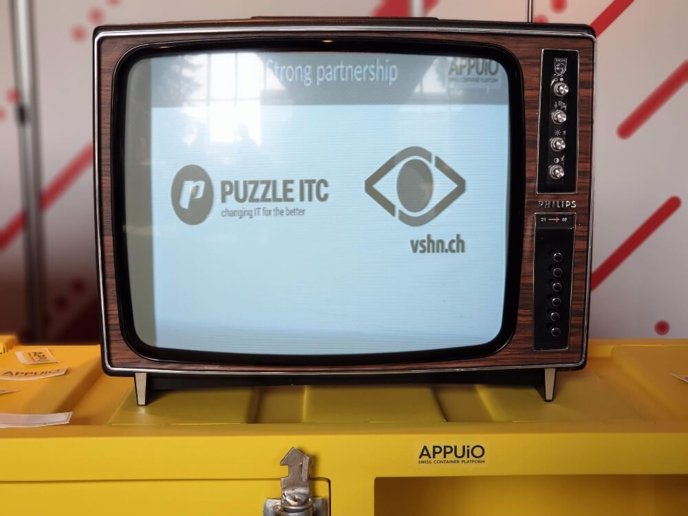

#### Red Hat und IBM

Die Übernahme von Red Hat durch IBM war neben den Open Source-, DevOps-, Microservices- und Container-Themen ein zentraler Schwerpunkt. Nach Meinungen des Managements wie auch der einzelnen Mitarbeitern, sei IBM eine grosse Chance und ein «Shareholder sowie Partner gleichzeitig». Es sei eine Gelegenheit, die neue Türen öffnet. Von der Beständigkeit Red Hat's wie sie heute ist, sind sie dennoch überzeugt.

#### APPUiO am Red Hat Forum

APPUiO war mit einem eigenen Stand vor Ort vertreten. Mit dabei natürlich: Ein gelber Container und das APPUiO-Team. Für das Team stand der Austausch mit den Besuchern im Vordergrund. Nicht nur neue Kontakte konnten geknüpft werden, hin und da besuchte ein bekanntes Gesicht den APPUiO-Stand. Spannende Keynotes und Breakout-Sessions liessen den tollen Tag abrunden.

Unser neuestes Gemeinschaftsprojekt. APPUiO on Philips. ;-) 

#### APPUiO beerup

Was wäre ein solch gelungener Tag bereits schon zu Ende? Das dachte sich APPUiO auch. Deshalb lud APPUiO die Besucher zu einem beerup in die Giesserei ein. Der Besucherdrang war noch grösser als beim ersten beerup im Sihlcity – ein richtiger Erfolg. In ungezwungener Atmosphäre wurde ein Bierchen getrunken, über dies und jenes gesprochen und den Tag ausgeklungen.

Aber nur wer in Besitz eines Golden-Tickets war, wurde von der strengen Einlasskontrolle hereingelassen.:-)

Wir freuen uns schon auf das nächste Treffen, bis dahin: Macht's gut!

Euer APPUiO-Team

