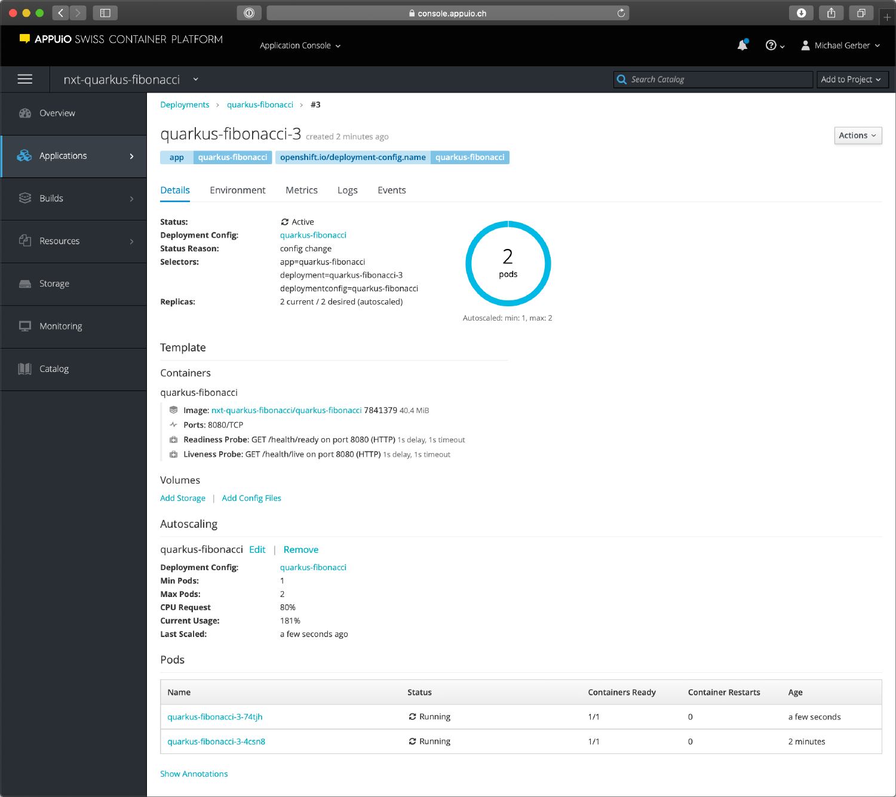

#### Create a Quarkus Project

The easiest starting point to create a [Quarkus](https://quarkus.io/) project is the website [https://code.quarkus.io](https://code.quarkus.io). The same concept is already known from Spring Boot [https://start.spring.io](https://start.spring.io/). This makes it easy to create a project with the needed libraries.

For this example choose the extensions _RESTEasy JAX-RS_ and _SmallRye Health_. RESTEasy JAX-RS, which is included as default, is used for REST web services and SmallRye Health is an extension that helps to integrate health checks.

#### Start the Application

To start Quarkus locally you just need to have Java 8 installed. With the command _./mvnw compile quarkus:dev_ you can start the application in development mode. Changes in the Java code are applied directly in the running application via hot deployment. Thus, a time-consuming application restart is not necessary 😃.

#### Create a REST Web Service

As an example application, we develop a REST web service that calculates a specific number in the [Fibonacci sequence](https://en.wikipedia.org/wiki/Fibonacci_number). The sequence is named after [Leonardo Fibonacci](https://en.wikipedia.org/wiki/Fibonacci), who described the growth of a rabbit population in 1202. The Fibonacci sequence can be calculated recursively as well as iteratively. To push the CPU a little bit, I use the recursive variant.

```
package nxt;

import javax.ws.rs.GET;
import javax.ws.rs.Path;
import javax.ws.rs.PathParam;
import javax.ws.rs.Produces;
import javax.ws.rs.core.MediaType;

@Path("/fibonacci")
public class FibonacciResource {

    @GET
    @Produces(MediaType.TEXT_PLAIN)
    @Path("{number}")
    public int fibonacci(@PathParam("number") Integer number) {
        if (number == 0) {
                return 0;
        }
        if (number == 1) {
                return 1;
        }
        return fibonacci(number - 2) + fibonacci(number - 1);
    }
}
```

The application can be tested with curl as follows:

```
curl http://0.0.0.0:8080/fibonacci/10
```

#### Test a REST Web Service

Quarkus uses the well-known library [REST-assured](http://rest-assured.io/) for REST web service tests. The web service created earlier can be tested with the following code:

```
package nxt;

import io.quarkus.test.junit.QuarkusTest;
import org.junit.jupiter.api.Test;

import static io.restassured.RestAssured.given;
import static org.hamcrest.CoreMatchers.is;

@QuarkusTest
public class FibonacciResourceTest {

    @Test
    public void testEndpoint() {
       testFibonacci(0, 0);
       testFibonacci(1, 1);
       testFibonacci(2, 1);
       testFibonacci(3, 2);
       testFibonacci(4, 3);
       testFibonacci(5, 5);
       testFibonacci(6, 8);
    }
    private void testFibonacci(int number, int fibonacci) {
       given()
          .when().get("/fibonacci/"+ number)
          .then()
            .statusCode(200)
            .body(is(String.valueOf(fibonacci)));
    }
}
```

The test can be executed with the command _./mvnw test._

#### Build Application on APPUiO

For the application to run on APPUiO, a Swiss OpenShift platform, it must first be built. The Quarkus team provides an OpenShift Source-to-Image (S2I) build.

With the following command you can create a new build on OpenShift and start it automatically:

```
oc new-build quay.io/quarkus/ubi-quarkus-native-s2i:19.2.1~https://gitlab.com/nxt/public/quarkus-fibonacci.git \
  --name=quarkus-fibonacci-build
```

The [GraalVM](https://www.graalvm.org/), which creates a native image from the Java code, needs a lot of computing power. In order for the build on APPUiO to acquire the needed resources, it has to be configured appropriately.

```
oc patch bc/quarkus-fibonacci-build \
  -p '{"spec":{"resources":{"requests":{"cpu":"0.5", "memory":"2Gi"},"limits":{"cpu":"4", "memory":"4Gi"}}}}'
```

The above command sets the build job limit to 4 CPUs and 4 gigabytes of RAM.

The great thing about APPUiO is that the resources needed for the build are not pulled from the project’s own resources. So you can push your own project to the limit and still run builds on OpenShift 😎.

The disadvantage of this approach is that the resulting docker image has a size of 600 MB 🤔. This is because the docker image contains the entire _GraalVM_. A Docker multistage build can solve this problem nicely.

The following docker file contains a multistage build where the native image is built first with _GraalVM_ and after that a minimal docker image based on _ubi-minimal is built_.

```
## Stage 1 : build with maven builder image with native capabilities
FROM quay.io/quarkus/centos-quarkus-maven:19.2.1
COPY src /usr/src/app/src
COPY pom.xml /usr/src/app
USER root
RUN chown -R 1001 /usr/src/app
USER 1001
RUN mvn -f /usr/src/app/pom.xml package -Pnative -e -B -DskipTests -Dmaven.javadoc.skip=true -Dmaven.site.skip=true -Dmaven.source.skip=true -Djacoco.skip=true -Dcheckstyle.skip=true -Dfindbugs.skip=true -Dpmd.skip=true -Dfabric8.skip=true -Dquarkus.native.enable-server=true

## Stage 2 : create the docker final image
FROM registry.access.redhat.com/ubi8/ubi-minimal
WORKDIR /work/
COPY --from=0 /usr/src/app/target/*-runner /work/application
RUN chmod 775 /work
EXPOSE 8080
CMD ["./application", "-Dquarkus.http.host=0.0.0.0"]
```

On OpenShift, you can run multistage docker builds. The first of the following two commands creates the image stream for the new lean docker image and the second one creates the docker build.

```
oc create is quarkus-fibonacci
oc create -f - | << EOF
{
    "apiVersion": "build.openshift.io/v1",
    "kind": "BuildConfig",
    "metadata": {
        "labels": {
             "build": "quarkus-fibonacci-build"
        },
        "name": "quarkus-fibonacci-build"
    },
    "spec": {
        "output": {
            "to": {
                "kind": "ImageStreamTag",
                "name": "quarkus-fibonacci:latest"
            }
        },
        "resources": {
            "limits": {
                 "cpu": "4",
                 "memory": "4Gi"
             },
             "requests": {
                 "cpu": "500m",
                 "memory": "2Gi"
             }
        },
        "source": {
             "git": {
                 "uri": "https://gitlab.com/nxt/public/quarkus-fibonacci.git"
             },
             "type": "Git"
        },
        "strategy": {
             "type": "Docker"
        }
    }
}
EOF
```

#### Publish Application to APPUiO

The previously built application can be published on APPUiO with the following two commands:

```
oc new-app --image-stream=quarkus-fibonacci:latest
oc expose svc quarkus-fibonacci
```

The first command creates a deployment with a Pod and a corresponding service. The second command creates a route for the given service that makes the microservice available to the public.

The command below allows you to test the newly deployed application:

```
curl http://$(oc get route | grep quarkus-fibonacci | awk '{print $2}')/fibonacci/1
```

#### Set up Health Checks

Quarkus has an extension that offers health checks out of the box. If the extension has not yet been added to the project, it can be added with the command _./mvnw quarkus:add-extension -Dextensions="health"_. Quarkus will then automatically create health check endpoints that can be called via the URL _/health/live_ and **/health/ready**.

In OpenShift the health checks can be added with the following command:

```
oc set probe dc/quarkus-fibonacci --liveness --get-url=http://:8080/health/live --initial-delay-seconds=1
oc set probe dc/quarkus-fibonacci --readiness --get-url=http://:8080/health/ready --initial-delay-seconds=1
```

#### Autoscaling

Quarkus applications can be started extremely quickly. This feature is especially useful when using the autoscaling feature. This allows you to start and stop pod’s dynamically when needed.

```
oc autoscale dc/quarkus-fibonacci --min 1 --max 2 --cpu-percent=80
```

The command above adds autoscaling, which starts a second Pod when needed. As soon as the load decreases again, the additional Pod is automatically shut down again.

Autoscaling can be tested with the ApacheBench tool from Apache.

```
ab -n 5000 -c2 http://$(oc get route | grep quarkus-fibonacci | awk '{print $2}')/fibonacci/30
```

This command sends 5000 parallel requests to the microservice. After a few seconds OpenShift will start the second Pod, which will be ready to use immediately.

#### Conclusion

With Quarkus you can quickly and easily build a microservice with Java, which meets all requirements to be operated efficiently in an OpenShift or Kubernetes.

You can study [the complete code on in GitLab repository](https://gitlab.com/nxt/public/quarkus-fibonacci).


