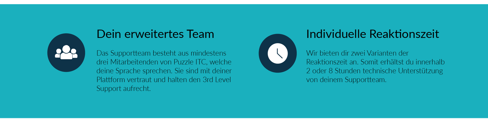

Die Supportleistungen beziehen sich auf die Analyse und Lösung einer zu definierenden technischen Problemstellung. Zusätzlich hast du als Kunde die Möglichkeit, das Supportteam bei fachlichen und technischen Fragestellungen zu konsultieren. Den Support bieten wir auf den beiden Distributionen OpenShift und Rancher.

Mehr Informationen zu den oben aufgelisteten Punkten findest du in diesem PDF.

Haben wir dein Interesse geweckt? Dann melde dich bei unserem Spezialisten [Tobias Tröhler](mailto:troehler@puzzle.ch).

Wir freuen uns auf deine Kontaktaufnahme!