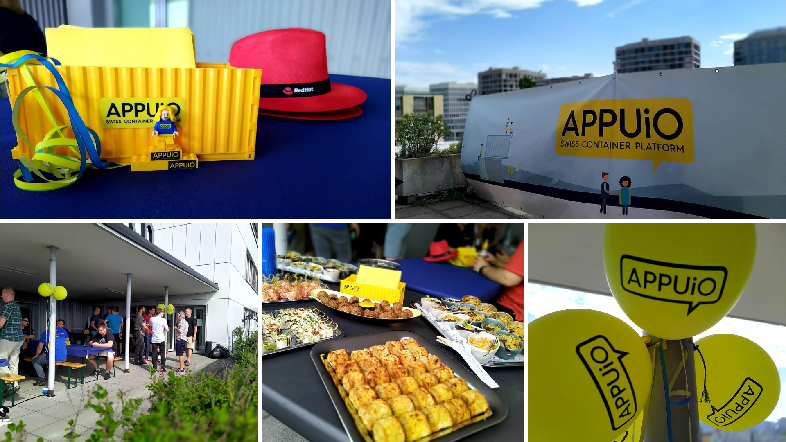

Glücklich und zufrieden schauen wir auf sechs  Jahre APPUiO zurück. Unglaublich, was der Zusammenschluss und das Engagement von zwei tollen Firmen, in diesem Fall Puzzle ITC GmbH und die VSHN AG, alles bewirken kann!

Im Jahr 2016 fing unsere Reise mit APPUiO an. Die Lösung wurde ursprünglich für die Professionalisierung unserer internen IT entwickelt. Wusstest du das? Wir merkten jedoch schnell, dass grosses Potential in APPUiO schlummerte! So ging APPUiO kurz darauf mit drei Angeboten an den Start, welche bis heute - natürlich mit stetiger Weiterentwicklung - Bestandteil sind. Die Lösung wurde rasch von etlichen Kunden produktiv eingesetzt und von einer starken Community gestützt. Einen besseren Einstieg in die grosse weite Welt hätten wir uns nicht vorstellen können.

So war APPUiO und auch unser Enthusiasmus seit dem Launch nicht mehr zu bremsen. Wir feierten nicht nur die Einführung der OpenShift Techlabs und Application Migration and Modernization Techlabs als Meilenstein. Auch der Beginn der Partnerschaft mit den beiden wunderbaren Firmen Red Hat und Rancher war ein Highlight. Im Jahr 2020 konnten wir, durch den Release von OpenShift 4, bereits früh produktiver Workload auf die OpenShift Container Platform (OCP) in der Version 4.4 packen und unser OpenShift Techlab auf der neuen Version laufen lassen. Ein weiterer grosser Meilenstein war auch die Einführung von APPUIO Cloud, unserem auf OpenShift 4 basierenden Namespace-as-a-Service Angebot als Nachfolgeprodukt von APPUiO Public (OCP3). Wir haben APPUiO Cloud als schnelle, kostengünstige Lösung für DevOps-Teams entwickelt, die sofortigen und erschwinglichen Zugang zu einem OpenShift 4-Projekt benötigen, ohne sich um die Installation und Wartung eines vollständigen OpenShift 4-Clusters kümmern zu müssen. Ein weiteres Highlight war die Einführung der Beerup's, welche uns nicht nur aufgrund der kühlen Getränken Freude bereitete . Wir konnten dadurch spannende Talks in ungezwungener Atmosphäre durchführen. Lernen und geniessen, lautet das Motto.\
Nebenher konnten wir in diesen sechs Jahren viele neue Features entwickeln, viele neue Bekanntschaften sowie Freundschaften schliessen und interessante Gespräche führen. Wir geniessen es sehr, eine solch starke Community hinter uns haben und freuen uns auf die Zukunft mit euch!

Wir bedanken uns, für das lustige und unterhaltsame Birthday Barbecue am 30. Juni 2022. Auf der Dachterrasse in Zürich durften wir neben der tollen Aussicht, leckere Grillade und eure Anwesenheit geniessen!

Ein grosses Merci auch an unsere Partnerfirma [Red Hat](https://www.redhat.com/de), welche uns mit einem grosszügigen Sponsoring unterstützt hat.

Bis auf bald!\
Dein APPUiO-Team

