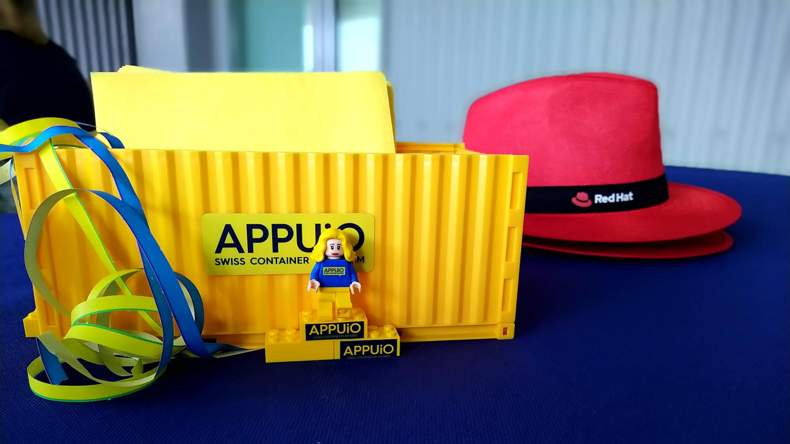

We look back on six years of APPUiO happy and satisfied. Unbelievable what the merger and commitment of two great companies, in this case, Puzzle ITC GmbH and VSHN AG, can achieve!

Our journey with APPUiO began in 2016. The solution was originally developed to professionalize our internal IT. Did you know that? But we quickly realized the great potential of APPUiO! So we launched it shortly thereafter with three offerings, which are still part of the solution today–of course with constant further development. Several customers quickly adopted the solution in production, supported by a strong community. We could not have imagined a better entry into the big wide world.

So APPUiO and our enthusiasm since the launch was unstoppable. Not only did we celebrate the launch of the OpenShift Techlabs and Application Migration and Modernization Techlabs as a milestone. The start of the partnership with two wonderful companies, Red Hat and Rancher, was also a highlight. In 2020, with the release of OpenShift 4, we were able to pack early production workloads onto OpenShift Container Platform (OCP) version 4.4 and run our OpenShift Techlab on the new version.

Another big milestone was also the launch of APPUIO Cloud, our OpenShift 4-based Namespace-as-a-Service offering as the successor to APPUiO Public (OCP3). We designed APPUiO Cloud as a fast, cost-effective solution for DevOps teams that need immediate and affordable access to an OpenShift 4 project without having to worry about installing and maintaining a full OpenShift 4 cluster. Another highlight was the introduction of Beerups, which we enjoyed not only because of the cool drinks . It allowed us to hold exciting talks in an informal atmosphere. Learn and enjoy, that's the motto.

Along the way, we were able to develop many new features, make many new acquaintances, as well as friends and have interesting conversations during these six years. We enjoy having such a strong community behind us and look forward to the future with you!

We would like to thank you for the fun and entertaining Birthday Barbecue on June 30, 2022, on the roof terrace in Zurich, where we enjoyed the great view, delicious barbecue and your presence!

A big thank you also to our partner company [Red Hat](https://www.redhat.com/en), which supported us with a generous sponsorship.

See you soon!\
Your APPUiO-Team

