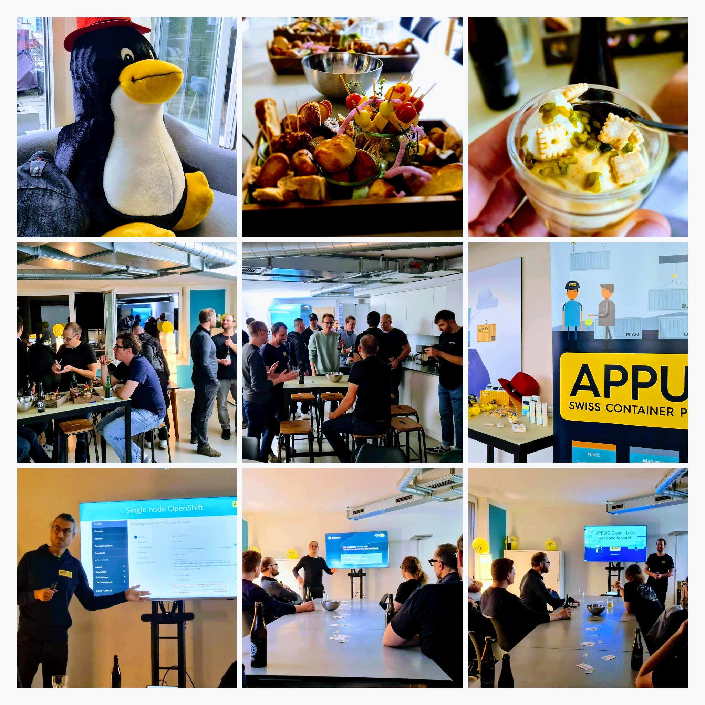

Bereits beim Eintreffen der Gäste war die Stimmung fantastisch. Dies, nicht nur weil man gleich ein kühles Bier in der Hand hatte, sondern auch weil man die [Community](https://www.appuio.ch/community/) physisch treffen konnte.

Um 17:00 Uhr startete Rémy Schumm mit dem ersten Talk. Der CTO von [Sobrado](https://landing.sobrado.ch/de/) stellte in seinem Talk die Nutzung von APPUiO Cloud vor. Die Gäste erhielten Einblicke zum aktuellen Einsatz der Plattform bei Sobrado und welche Herausforderungen dabei zu bewältigen sind. Zudem nutzte er die Gelegenheit, um ein paar Feature-Requests auszusprechen.

Als nächstes hielt Tobias Brunner, CTO von VSHN, einen Talk über den bisherigen Weg von [APPUiO Cloud](https://www.appuio.ch/offering/cloud/) und dessen Zukunft. Einige offenen Punkte konnten so mit Rémy gleich ad-hock gelöst werden. Tobru, auch dir vielen Dank, dass du bzgl. APPUiO Cloud updated hast.

Zum Schluss sprach Benjamin Affolter, Plattform Architekt von Puzzle ITC, über die verschiedenen Flavors von OpenShift. Auf den Punkt gebracht und humorvoll erfuhren wir, was die verschiedenen Begriffe rund um OpenShift sollen und was sie für die Zukunft bedeuten.

PS. Falls du nicht teilnehmen konntest oder du die Talks nochmals anschauen möchtest, kannst du dies [hier](https://youtu.be/L7cQE0F2iPM) machen.

Nach den Talks gab es mehr zu trinken und feine Häppchen zu essen. Es entstanden interessante Gespräche und wir erlebten lustige Momente. Als dann die letzten Gäste um 21:00 Uhr den Event verliessen, lag eine wohltuende Zufriedenheit in der Luft. Oh, war das schön!

APPUiO möchte sich bei den Speakern und Gästen für ihre Teilnahme bedanken. Es war wie immer wunderschön euch wieder einmal zu sehen und wir freuen uns bereits auf nächstes Mal. Bis dahin wünschen wir allen viel Gesundheit und ein schönes restliches Jahr.

