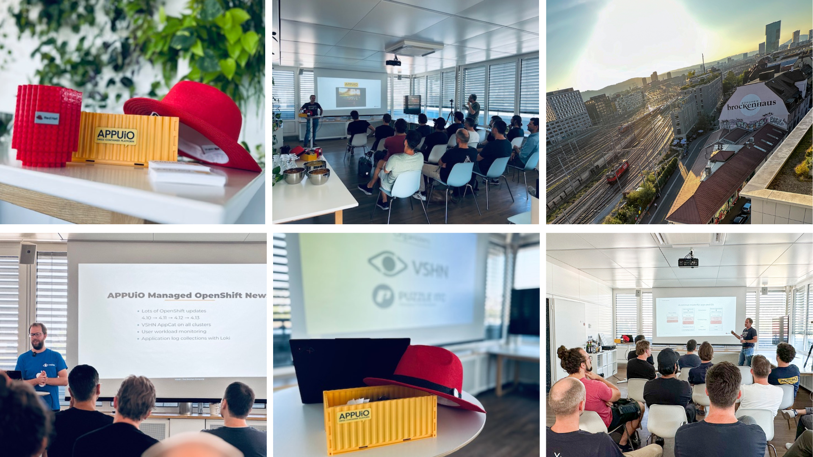

### OpenShift and Beyond: A Glimpse into the Future

The session started with Peter Mumenthaler, Solution Architect at Red Hat. In his presentation "OpenShift and Beyond," he provided an overview of the recent developments in the OpenShift domain. Over the years, OpenShift has established itself as one of the leading application platforms based on Kubernetes. It impresses not just with its user-friendliness but also with its compelling functionalities.

Peter highlighted the exciting features and optimizations currently in progress and what the OpenShift community can expect in the near future. The roadmap for OpenShift seems promising, and we certainly look forward to some innovations.

Want to know more about Peter Mumenthaler's presentation? Here are the slides.

### APPUiO Cloud and Managed Update: What's New?

In the second talk, Tobias Brunner, CTO at VSHN, presented the latest news from the APPUiO Managed and APPUiO Cloud universe. Both APPUiO Managed and APPUiO Cloud, based on OpenShift, have seen numerous updates and expansions in recent months.

Tobias provided a comprehensive insight into the recent changes, which included both technical enhancements and new features for end-users. APPUiO constantly strives to further develop these two products to cater to the needs of its users.

Want to learn more about Tobias Brunner's presentation? Check out the slides.

### Conclusion

With over 25 participants, the 8th edition of Beerup was a tremendous success. It offered not only a chance to discuss the latest developments in the container realm in a relaxed atmosphere but also provided insights into the future direction of OpenShift, APPUiO Managed, and APPUiO Cloud.

### Missed the Beerup?

For those who missed Beerup or wish to revisit the presented content: The sessions were recorded and can be viewed anytime on the provided stream. It's definitely worth a watch!

We're excited about what the future holds and are eagerly anticipating the next Beerup. Cheers!

